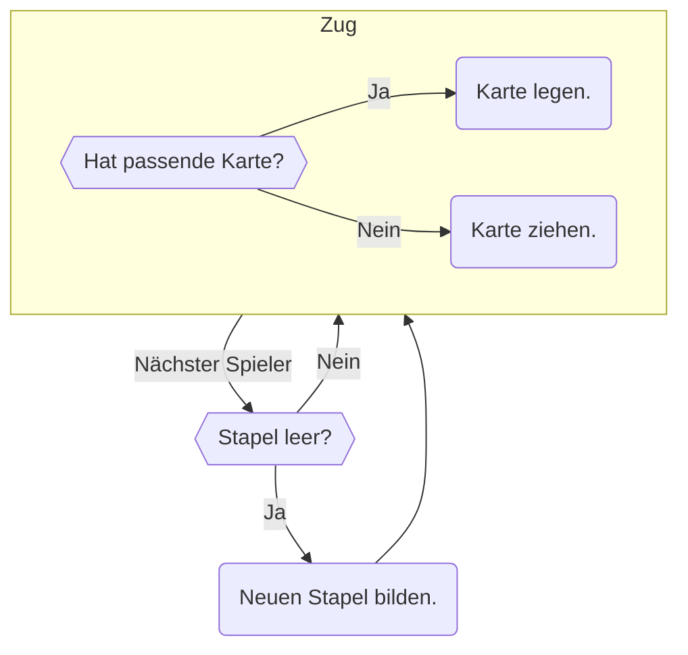
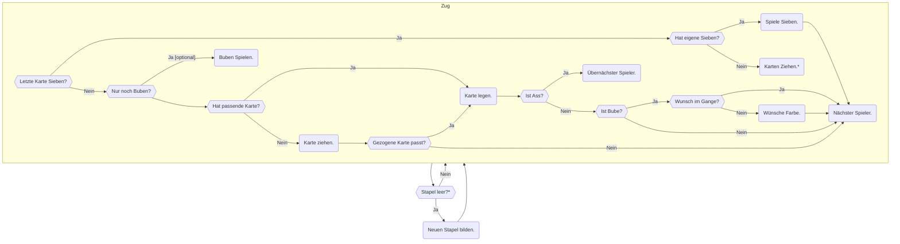
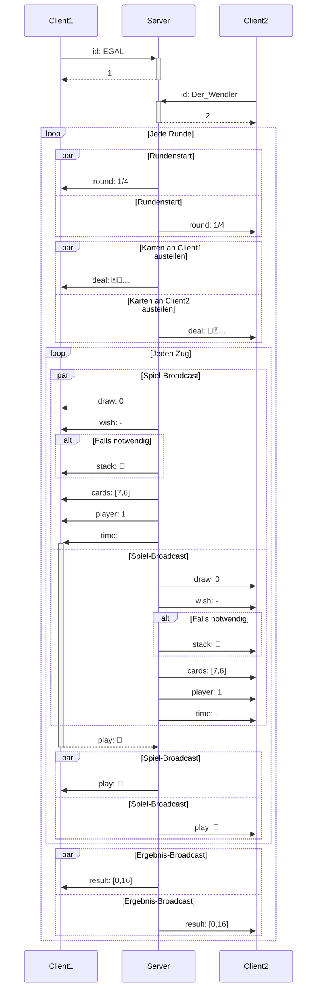

# Mau-Mau

## Spielregeln

### Grundregeln
Mau-Mau ist ein Auslegespiel.
Gewonnen hat, wer zuerst alle seine Karten abgespielt hat.
Am Ende werden die [Punkte](#punkte) der Restkarten gezählt.

Zu Beginn erhält jeder Spieler sechs Karten.
Der erste Spieler erhält sieben.
Die restlichen Karten werden verdeckt als Stapel abgelegt.
Die erste Karte des Stapels wird neben diesem aufgedeckt.

Reihum legt jeder Spieler, sofern möglich, eine seiner Karten offen auf die nebenliegende Karte.
Möglich ist dies, wenn die abzulegende Karte in Wert oder Farbe mit der obersten offenen Karte übereinstimmt.
Kann ein Spieler keine Karte ablegen, so muss er eine Karte vom Stapel ziehen.
Danach ist der nächste Spieler an der Reihe.
Sobald sich keine Karten mehr im Stapel befinden wird aus den offenen Karten, abzüglich der obersten,
ein neuer Stapel gebildet.

### Weitere Regeln
- Wer eine passende Karte zieht, darf diese ablegen.
- Wird eine Sieben gelegt, so muss die nächste Person zwei Karten ziehen.
  - Kann die nächste Person allerdings auch eine Sieben legen, muss deren Nachfolger vier Karten ziehen, usw.
  - Hat der letzte Spieler in dieser Reihe seine Karten aufgenommen, so beginnt dessen Zug ganz normal.
- Wird ein Ass gelegt, so muss der nächste Spieler aussetzen.
- Ein Bube kann auf alle Karten gespielt werden.
- Wird ein Bube gelegt, so darf der auslegende Spieler sich die Farbe wünschen, die als Nächstes zu legen ist.
  - Wird ein Bube im Anschluss an einen Wunsch gelegt, so entfällt das Wunschrecht.
  - Der Wunsch gilt dann als erfüllt, der zweite Bube wird als Karte der Farbe des Wunsches aufgefasst.
- Hält ein Spieler nur noch Buben, so darf er diese in seinem letzten Zug alle auf einmal ablegen.
- Kann ein Spieler auslegen, so ist er dazu verpflichtet.

### Punkte
Die Wertung wird wie folgt vorgenommen:

| Karte       | Wert      |
|-------------|-----------|
| 7, 8, 9, 10 | Nach Wert |
| Bube        | 20        |
| Dame        | 10        |
| König       | 10        |
| Ass         | 11        |

Der Spieler, der nach allen Runden die meisten Punkte hat, verliert.

## Semantische Gliederung
### Grundregeln

### Erweitert

_&#42; Karten werden auch neu gemischt,
wenn ein Spieler der mehrere Karten ziehen musste nur einen Teil dieser ziehen konnte, 
damit dieser auch die restlichen Karten aufnehmen kann._

## Netzwerkprotokoll

Der ganze Spaß wird aufgeteilt in zwei Teile. Zum einen den Server und zum anderen die Clients.
Nach einem Handshake, bei dem die Clients ihre Spielnummer bekommen teilt der Server die Karten aus.
Damit beginnt das Spiel.
Hier broadcastet der Server welcher Spieler am Zug ist.
Dieser Antwortet mit den möglichen Aktionen, die wiederum vom Server an alle anderen gebroadcastet werden.
Zieht ein Spieler Karten, wird den anderen Spielern nur deren Anzahl, dem Spieler selber aber deren Werte mitgeteilt.

Dabei werden folgende Nachrichten versendet:

| Sender | Empfänger | Typ    | Hex    | Werte      |
|--------|-----------|--------|--------|------------|
| Client | Server    | id     | `0x42` | String     |
| Server | Client    | deal   | `0x69` | \[Karte]   |
| Server | Broadcast | draw   | `0x6A` | integer    |
| Server | Broadcast | wish   | `0x6B` | Farbe      |
| Server | Broadcast | stack  | `0x6C` | Karte      |
| Server | Broadcast | cards  | `0x6D` | \[integer] |
| Server | Broadcast | player | `0x6E` | integer    |
| Server | Broadcast | time   | `0x6F` | long       |
| Client | Server    | play   | `0x43` | Karte      |
| Client | Server    | take   | `0x44` | integer    |
| Client | Server    | finish | `0x45` | N/A        |
| Client | Server    | wish   | `0x46` | Farbe      |
| Server | Broadcast | play   | `0x70` | Karte      |
| Server | Broadcast | finish | `0x71` | N/A        |
| Server | Broadcast | round  | `0x72` | integer^2  |
| Server | Broadcast | result | `0x73` | \[integer] |
| Server | Broadcast | yeet   | `0x74` | integer    |
| Client | Server    | yeet   | `0x47` | N/A        |

- Strings werden `UTF-16` kodiert und `\0` terminiert.
- Integer werden als `uint_8` versendet
- Longs werden als `int_64` versendet
- Farben werden wie folgt kodiert:
  - | Farbe | Hex    |
    |-------|--------|
    | ♦️    | `0x31` |
    | ♥️    | `0x41` |
    | ♣️    | `0x15` |
    | ♠️    | `0x92` |
- Karten setzen sich zusammen aus `[Farbcode]` und `[Wert]`
  - | Wert  | Hex   |
    |-------|-------|
    | 7     | `0x7` |
    | 8     | `0x8` |
    | 9     | `0x9` |
    | 10    | `0xA` |
    | Bube  | `0xB` |
    | Dame  | `0xC` |
    | König | `0xD` |
    | Ass   | `0xE` |
- Listen setzen sich zusammen als `[Wert]` `0x1` `[Wert]` ... `[Wert]` `0x0`

### Formelles Protokoll
Die Verbindung läuft über TCP unverschlüsselt.
1. Handshake:
   1. Client -> Server: `id <identifier>`
   2. Server -> Client: `uint8`
   > Der Client authentifiziert sich mit dem angegebenen identifier und bekommt seine Spieler-ID zugewiesen.
2. Round Announcement:
   - Server-Broadcast: `round: <round>`
   > Der Server gibt den Beginn der angegebenen Spielrunde bekannt.
3. Dealing:
   - Server -> Client: `deal <cards...>`
   > Der Server verteilt die Karten an jeden Client.
4. Turn:
   1. Server-Broadcast: `draw: <amount>`
   2. Server-Broadcast: `wish: <color|\0>`
   3. \[Server-Broadcast: `stack: <card>`]
   4. Server-Broadcast: `cards: <ints...>`
   5. Server-Broadcast: `player: <number>`
   6. Server-Broadcast: `time: <millis>`
   > Der Server broadcastet die aktuelle Zuginformation.
   > Anzahl der zu ziehenden Karten, Farbe des aktiven Wunsches,
   > Falls nötig den neuen Ablagestapel (einzelne Karte nach neuem Mischen),
   > Die Anzahl der Karten jedes Spielers,
   > Die Spielernummer (ID) des aktiven Spielers,
   > Dessen Zeit in [ms] oder 0, falls kein Limit angewendet wird.
   7. Client-Server: `play: <card> | take: <number> | finish: - | wish: <color>`
   8. Server-Broadcast: `play: <card> | draw: <number> | finish: - | wish: <color>`
   9. \[Server-Client: `deal: <cards...>`]
   > Der Client sendet dem Server seinen Zug.
   > Dieser spiegelt diesen dann an alle anderen.
   > Muss der Client Karten ziehen erhält er zusätzlich die Information über die erhaltenen Karten.
5. Results:
   - Server-Broadcast: `result: <ints...>`
   > Nach jeder Runde verkündet der Server den aktuellen Spielstand
- Yeeting:
   - Server-Broadcast: `yeet: <player>`
   - Client-Server: `yeet: -`
   > Jeder Spieler kann jederzeit das Spiel verlassen.
   > Der Server kann jederzeit bekannt geben, dass ein Spieler das Spiel verlassen hat.