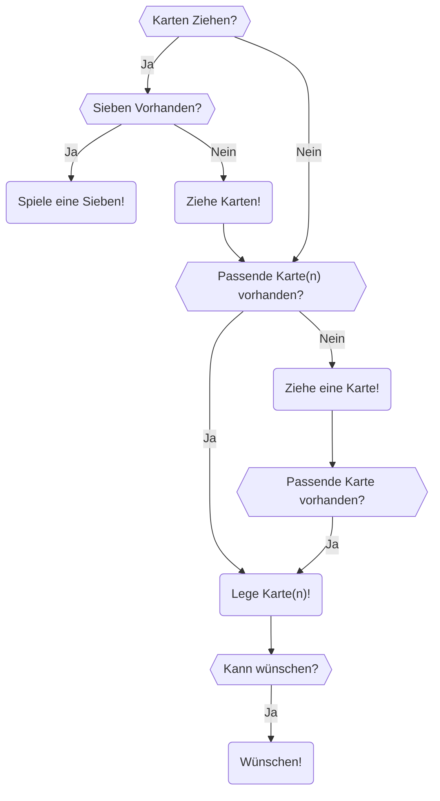

# Karten

Um genau zu sein Mau-Mau. Nach den einzig wahren Spielregeln:
 - **7** ist zwei ziehen
 - **Ass** bedeutet aussetzen
 - **Bube** bedeutet wünschen

Das Ziehen kann akkumuliert werden, Bube bedient, Wünschen auf Wünschen stinkt, wer legen kann, der muss ziehen,
wer nicht kann, der muss eine Karte ziehen, auch nachdem er Strafziehungen wegen einer Sieben hatte,
und nach diesen Ziehungen wird **nicht** ausgesetzt. Außerdem kann mit mehreren Buben vorzeitig Schluss gemacht werden.

Ansonsten wird Farbe auf Farbe und Wert auf Wert gelegt.
Gespielt wird mit einem 32-er-Set, also 7, 8, 9, 10, Bube, Dame, König, Ass.

Die Wertung wird wie folgt vorgenommen:

| Karte       | Wert      |
|-------------|-----------|
| 7, 8, 9, 10 | Nach Wert |
| Bube        | 20        |
| Dame        | 10        |
| König       | 10        |
| Ass         | 11        |

Der Spieler, der nach allen Runden die meisten Punkte hat, verliert.

## Semantische Gliederung

Ein **Spiel** besteht aus mehreren **Runden**.

In jeder **Runde** beginnt ein anderer **Spieler**.

Jeder **Spieler** hat eine **Hand**.

Bei jedem **Zug** hat der **Spieler** mehrere Möglichkeiten:

