# Mau-Mau

## Spielregeln

### Grundregeln
Mau-Mau ist ein Auslegespiel.
Gewonnen hat, wer zuerst alle seine Karten abgespielt hat.
Am Ende werden die [Punkte](#punkte) der Restkarten gezählt.

Zu Beginn erhält jeder Spieler sechs Karten.
Der erste Spieler erhält sieben.
Die restlichen Karten werden verdeckt als Stapel abgelegt.
Die erste Karte des Stapels wird neben diesem aufgedeckt.

Reihum legt jeder Spieler, sofern möglich, eine seiner Karten offen auf die nebenliegende Karte.
Möglich ist dies, wenn die abzulegende Karte in Wert oder Farbe mit der obersten offenen Karte übereinstimmt.
Kann ein Spieler keine Karte ablegen, so muss er eine Karte vom Stapel ziehen.
Danach ist der nächste Spieler an der Reihe.
Sobald sich keine Karten mehr im Stapel befinden wird aus den offenen Karten, abzüglich der obersten,
ein neuer Stapel gebildet.

### Weitere Regeln
- Wer eine passende Karte zieht, darf diese ablegen.
- Wird eine Sieben gelegt, so muss die nächste Person zwei Karten ziehen.
  - Kann die nächste Person allerdings auch eine Sieben legen, muss deren Nachfolger vier Karten ziehen, usw.
  - Hat der letzte Spieler in dieser Reihe seine Karten aufgenommen, so beginnt dessen Zug ganz normal.
- Wird ein Ass gelegt, so muss der nächste Spieler aussetzen.
- Ein Bube kann auf alle Karten gespielt werden.
- Wird ein Bube gelegt, so darf der auslegende Spieler sich die Farbe wünschen, die als Nächstes zu legen ist.
  - Wird ein Bube im Anschluss an einen Wunsch gelegt, so entfällt das Wunschrecht.
  - Der Wunsch gilt dann als erfüllt, der zweite Bube wird als Karte der Farbe des Wunsches aufgefasst.
- Hält ein Spieler nur noch Buben, so darf er diese in seinem letzten Zug alle auf einmal ablegen.
- Kann ein Spieler auslegen, so ist er dazu verpflichtet.

### Punkte
Die Wertung wird wie folgt vorgenommen:

| Karte       | Wert      |
|-------------|-----------|
| 7, 8, 9, 10 | Nach Wert |
| Bube        | 20        |
| Dame        | 10        |
| König       | 10        |
| Ass         | 11        |

Der Spieler, der nach allen Runden die meisten Punkte hat, verliert.

## Semantische Gliederung
### Grundregeln

```mermaid
flowchart TD
    stackEmpty{{Stapel leer?}}
    rebuildStack(Neuen Stapel bilden.)
    subgraph turn [Zug]
        hasMatchingCard{{Hat passende Karte?}}
        drawCard(Karte ziehen.)
        playCard(Karte legen.)
        hasMatchingCard -->|Ja| playCard
        hasMatchingCard -->|Nein| drawCard
    end
    turn -->|Nächster Spieler| stackEmpty
    stackEmpty -->|Ja| rebuildStack
    stackEmpty -->|Nein| turn
    rebuildStack --> turn
```

### Erweitert

```mermaid
flowchart TD
    stackEmpty{{Stapel leer?*}}
    rebuildStack(Neuen Stapel bilden.)
    subgraph turn [Zug]
        hasMatchingCard{{Hat passende Karte?}}
        drawCard(Karte ziehen.)
        playCard(Karte legen.)
        drawnCardMatches{{Gezogene Karte passt?}}
        isSeven{{Letzte Karte Sieben?}}
        hasSeven{{Hat eigene Sieben?}}
        playSeven(Spiele Sieben.)
        next(Nächster Spieler.)
        drawCards(Karten Ziehen.*)
        wasAce{{Ist Ass?}}
        skip(Übernächster Spieler.)
        wasJack{{Ist Bube?}}
        wish(Wünsche Farbe.)
        wishActive{{Wunsch im Gange?}}
        onlyJacks{{Nur noch Buben?}}
        playJacks(Buben Spielen.)
        hasMatchingCard -->|Ja| playCard
        hasMatchingCard -->|Nein| drawCard
        drawCard --> drawnCardMatches
        drawnCardMatches -->|Ja| playCard
        isSeven -->|Ja| hasSeven
        isSeven -->|Nein| onlyJacks
        hasSeven -->|Ja| playSeven
        drawnCardMatches -->|Nein| next
        playSeven --> next
        hasSeven -->|Nein| drawCards
        playCard --> wasAce
        wasAce -->|Ja| skip
        wasAce -->|Nein| wasJack
        wasJack -->|Ja| wishActive
        wasJack -->|Nein| next
        wish --> next
        wishActive -->|Ja| next
        wishActive -->|Nein| wish
        onlyJacks -->|"Ja [optional]"| playJacks
        onlyJacks --> hasMatchingCard
    end
    turn --> stackEmpty
    stackEmpty -->|Ja| rebuildStack
    stackEmpty -->|Nein| turn
    rebuildStack --> turn
```

_&#42; Karten werden auch neu gemischt,
wenn ein Spieler der mehrere Karten ziehen musste nur einen Teil dieser ziehen konnte, 
damit dieser auch die restlichen Karten aufnehmen kann._

## Netzwerkprotokoll

Der ganze Spaß wird aufgeteilt in zwei Teile. Zum einen den Server und zum anderen die Clients.
Nach einem Handshake, bei dem die Clients ihre Spielnummer bekommen teilt der Server die Karten aus.
Damit beginnt das Spiel.
Hier broadcastet der Server welcher Spieler am Zug ist.
Dieser Antwortet mit den möglichen Aktionen, die wiederum vom Server an alle anderen gebroadcastet werden.
Zieht ein Spieler Karten, wird den anderen Spielern nur deren Anzahl, dem Spieler selber aber deren Werte mitgeteilt.

```mermaid
sequenceDiagram
    participant c1 as Client1
    participant s as Server
    participant c2 as Client2
    c1->>+s: id: EGAL
    s-->>-c1: 1
    c2->>+s: id: Der_Wendler
    s-->>-c2: 2
    loop Jede Runde
        par Rundenstart
            s->>c1: round: 1/4
        and Rundenstart
            s->>c2: round: 1/4
        end
        par Karten an Client1 austeilen
            s->>c1: deal: 🃏🎴...
        and Karten an Client2 austeilen
            s->>c2: deal: 🎴🃏...
        end
        loop Jeden Zug
            par Spiel-Broadcast
                s->>c1: draw: 0
                s->>c1: wish: -
                alt Falls notwendig
                    s->>c1: stack: 🎴
                end
                s->>c1: cards: [7,6]
                s->>c1: player: 1
                s->>+c1: time: -
            and Spiel-Broadcast
                s->>c2: draw: 0
                s->>c2: wish: -
                alt Falls notwendig
                    s->>c2: stack: 🎴
                end
                s->>c2: cards: [7,6]
                s->>c2: player: 1
                s->>c2: time: -
            end
            c1-->>-s: play: 🎴
            par Spiel-Broadcast
                s->>c1: play: 🎴
            and Spiel-Broadcast
                s->>c2: play: 🎴
            end
        end
        par Ergebnis-Broadcast
            s->>c1: result: [0,16] 
        and Ergebnis-Broadcast
            s->>c2: result: [0,16]
        end
    end
```

Dabei werden folgende Nachrichten versendet:

| Sender | Empfänger | Typ    | Hex    | Werte      |
|--------|-----------|--------|--------|------------|
| Client | Server    | id     | `0x42` | String     |
| Server | Client    | deal   | `0x69` | \[Karte]   |
| Server | Broadcast | draw   | `0x6A` | integer    |
| Server | Broadcast | wish   | `0x6B` | Farbe      |
| Server | Broadcast | stack  | `0x6C` | Karte      |
| Server | Broadcast | cards  | `0x6D` | \[integer] |
| Server | Broadcast | player | `0x6E` | integer    |
| Server | Broadcast | time   | `0x6F` | long       |
| Client | Server    | play   | `0x43` | Karte      |
| Client | Server    | take   | `0x44` | integer    |
| Client | Server    | finish | `0x45` | N/A        |
| Client | Server    | wish   | `0x46` | Farbe      |
| Server | Broadcast | play   | `0x70` | Karte      |
| Server | Broadcast | finish | `0x71` | N/A        |
| Server | Broadcast | round  | `0x72` | integer^2  |
| Server | Broadcast | result | `0x73` | \[integer] |
| Server | Broadcast | yeet   | `0x74` | integer    |

- Strings werden `UTF-16` kodiert und `\0` terminiert.
- Integer werden als `uint_8` versendet
- Longs werden als `int_64` versendet
- Farben werden wie folgt kodiert:
  - | Farbe | Hex    |
    |-------|--------|
    | ♦️    | `0x31` |
    | ♥️    | `0x41` |
    | ♣️    | `0x15` |
    | ♠️    | `0x92` |
- Karten setzen sich zusammen aus `[Farbcode]` und `[Wert]`
  - | Wert  | Hex   |
    |-------|-------|
    | 7     | `0x7` |
    | 8     | `0x8` |
    | 9     | `0x9` |
    | 10    | `0xA` |
    | Bube  | `0xB` |
    | Dame  | `0xC` |
    | König | `0xD` |
    | Ass   | `0xE` |
- Listen setzen sich zusammen als `[Wert]` `0x1` `[Wert]` ... `[Wert]` `0x0`