# Karten

Um genau zu sein Mau-Mau. Nach den einzig wahren Spielregeln:
 - **7** ist zwei ziehen
 - **Ass** bedeutet aussetzen
 - **Bube** bedeutet wünschen

Das Ziehen kann akkumuliert werden, Bube bedient, Wünschen auf Wünschen stinkt, wer legen kann, der muss ziehen,
wer nicht kann, der muss eine Karte ziehen, auch nachdem er Strafziehungen wegen einer Sieben hatte,
und nach diesen Ziehungen wird **nicht** ausgesetzt. Außerdem kann mit mehreren Buben vorzeitig Schluss gemacht werden.

Ansonsten wird Farbe auf Farbe und Wert auf Wert gelegt.
Gespielt wird mit einem 32-er-Set, also 7, 8, 9, 10, Bube, Dame, König, Ass.

Die Wertung wird wie folgt vorgenommen:

| Karte       | Wert      |
|-------------|-----------|
| 7, 8, 9, 10 | Nach Wert |
| Bube        | 20        |
| Dame        | 10        |
| König       | 10        |
| Ass         | 11        |

Der Spieler, der nach allen Runden die meisten Punkte hat, verliert.

## Semantische Gliederung

Ein **Spiel** besteht aus mehreren **Runden**.

In jeder **Runde** beginnt ein anderer **Spieler**.

Jeder **Spieler** hat eine **Hand**.

Bei jedem **Zug** hat der **Spieler** mehrere Möglichkeiten:

```mermaid
flowchart TD
    hasToDraw{{Karten Ziehen?}}
    canAvert{{Sieben Vorhanden?}}
    avert(Spiele eine Sieben!)
    drawMultiple(Ziehe Karten!)
    canPlay{{"Passende Karte(n) vorhanden?"}}
    canPlayLastChance{{"Passende Karte vorhanden?"}}
    isWish{{Kann wünschen?}}
    wish(Wünschen!)
    drawOnce(Ziehe eine Karte!)
    act("Lege Karte(n)!")
    
    hasToDraw -->|Ja| canAvert
    hasToDraw -->|Nein| canPlay
    canAvert -->|Ja| avert
    canAvert -->|Nein| drawMultiple
    drawMultiple --> canPlay
    canPlay -->|Ja| act
    canPlay -->|Nein| drawOnce
    act --> isWish
    isWish -->|Ja| wish
    drawOnce --> canPlayLastChance
    canPlayLastChance -->|Ja| act
```

## Netzwerkprotokoll

Der ganze Spaß wird aufgeteilt in zwei Teile. Zum einen den Server und zum anderen die Clients.
Nach einem Handshake, bei dem die Clients ihre Spielnummer bekommen teilt der Server die Karten aus.
Damit beginnt das Spiel.
Hier broadcastet der Server welcher Spieler am Zug ist.
Dieser Antwortet mit den möglichen Aktionen, die wiederum vom Server an alle anderen gebroadcastet werden.
Zieht ein Spieler Karten, wird den anderen Spielern nur deren Anzahl, dem Spieler selber aber deren Werte mitgeteilt.

```mermaid
sequenceDiagram
    participant c1 as Client1
    participant s as Server
    participant c2 as Client2
    c1->>+s: id: EGAL
    s-->>-c1: 1
    c2->>+s: id: Der_Wendler
    s-->>-c2: 2
    loop Jede Runde
        par Rundenstart
            s->>c1: round: 1/4
        and Rundenstart
            s->>c2: round: 1/4
        end
        par Karten an Client1 austeilen
            s->>c1: deal: 🃏🎴...
        and Karten an Client2 austeilen
            s->>c2: deal: 🎴🃏...
        end
        loop Jeden Zug
            par Spiel-Broadcast
                s->>c1: draw: 0
                s->>c1: wish: -
                alt Falls notwendig
                    s->>c1: stack: 🎴
                end
                s->>c1: cards: [7,6]
                s->>c1: player: 1
                s->>+c1: time: -
            and Spiel-Broadcast
                s->>c2: draw: 0
                s->>c2: wish: -
                alt Falls notwendig
                    s->>c2: stack: 🎴
                end
                s->>c2: cards: [7,6]
                s->>c2: player: 1
                s->>c2: time: -
            end
            c1-->>-s: play: 🎴
            par Spiel-Broadcast
                s->>c1: play: 🎴
            and Spiel-Broadcast
                s->>c2: play: 🎴
            end
        end
        par Ergebnis-Broadcast
            s->>c1: result: [0,16] 
        and Ergebnis-Broadcast
            s->>c2: result: [0,16]
        end
    end
```

Dabei werden folgende Nachrichten versendet:

| Sender     | Empfänger     | Typ      | Hex        | Werte       |
|------------|---------------|----------|------------|-------------|
| Client     | Server        | id       | `0x42`     | String      |
| Server     | Client        | deal     | `0x69`     | \[Karte]    |
| Server     | Broadcast     | draw     | `0x6A`     | integer     |
| Server     | Broadcast     | wish     | `0x6B`     | Farbe       |
| Server     | Broadcast     | stack    | `0x6C`     | Karte       |
| Server     | Broadcast     | cards    | `0x6D`     | \[integer]  |
| Server     | Broadcast     | player   | `0x6E`     | integer     |
| Server     | Broadcast     | time     | `0x6F`     | long        |
| Client     | Server        | play     | `0x43`     | Karte       |
| Client     | Server        | take     | `0x44`     | integer     |
| Client     | Server        | finish   | `0x45`     | N/A         |
| Client     | Server        | wish     | `0x46`     | Farbe       |
| Server     | Broadcast     | play     | `0x70`     | Karte       |
| ~~Server~~ | ~~Broadcast~~ | ~~take~~ | ~~`0x71`~~ | ~~integer~~ |
| Server     | Broadcast     | round    | `0x72`     | integer^2   |
| Server     | Broadcast     | result   | `0x73`     | \[integer]  |
| Server     | Broadcast     | yeet     | `0x74`     | integer     |

- Strings werden `UTF-16` kodiert und `\0` terminiert.
- Integer werden als `uint_8` versendet
- Longs werden als `int_64` versendet
- Farben werden wie folgt kodiert:
  - | Farbe | Hex    |
    |-------|--------|
    | ♦️    | `0x31` |
    | ♥️    | `0x41` |
    | ♣️    | `0x15` |
    | ♠️    | `0x92` |
- Karten setzen sich zusammen aus `[Farbcode]` und `[Wert]`
  - | Wert  | Hex   |
    |-------|-------|
    | 7     | `0x7` |
    | 8     | `0x8` |
    | 9     | `0x9` |
    | 10    | `0xA` |
    | Bube  | `0xB` |
    | Dame  | `0xC` |
    | König | `0xD` |
    | Ass   | `0xE` |
- Listen setzen sich zusammen als `[Wert]` `0x1` `[Wert]` ... `[Wert]` `0x0`